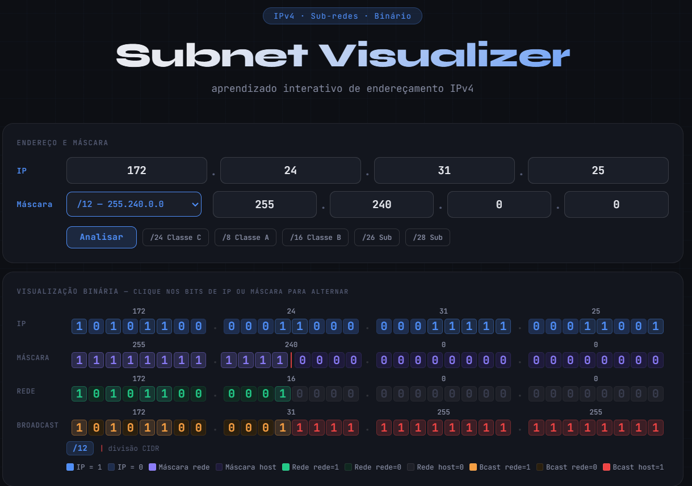
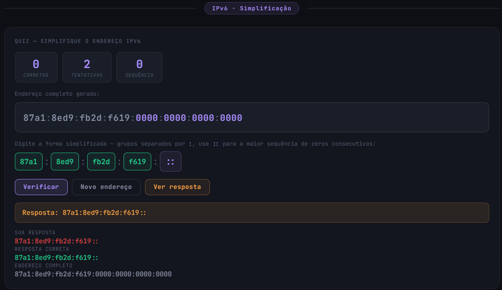

# IP-TOOLS

> Ferramenta web educacional para praticar endereçamento IP com visualização interativa de **IPv4 subnetting** e **quiz de simplificação IPv6**.


## 📚 Sumário

- [Visão geral](#-visão-geral)
- [Demonstração](#-demonstração)
- [Funcionalidades](#-funcionalidades)
- [Estrutura do projeto](#-estrutura-do-projeto)
- [Como executar](#-como-executar)
- [Como usar](#-como-usar)
- [Roadmap](#-roadmap)
- [Tecnologias](#-tecnologias)
- [Contribuição](#-contribuição)
- [Licença](#-licença)

## 🔎 Visão geral

O **IP-TOOLS** foi criado para facilitar o aprendizado visual de redes.

- No módulo **IPv4**, você entende rede, broadcast, hosts e operações binárias em tempo real.
- No módulo **IPv6**, você pratica compressão/simplificação com feedback imediato.

## 🎬 Demonstração

### IPv4 Subnet Visualizer


### Quiz IPv6


## ✨ Funcionalidades

### IPv4 Subnet Visualizer
- Entrada de IP por octetos (0–255)
- Seleção de máscara por CIDR e edição manual da máscara
- Presets rápidos (`/8`, `/16`, `/24`, `/26`, `/28`)
- Visualização binária de IP, Máscara, Rede e Broadcast
- Interação por clique nos bits de IP e Máscara
- Cálculo passo a passo com explicações de AND/OR/NOT
- Resumo final com Rede, Broadcast, 1º/último host e hosts usáveis

### Quiz IPv6
- Geração aleatória de endereços IPv6 completos
- Exercício de simplificação com regras de compressão
- Verificação da resposta com feedback visual
- Placar de desempenho (corretos, tentativas, sequência)
- Ações rápidas: verificar, novo endereço e ver resposta

## 🧱 Estrutura do projeto

```text
IP-TOOLS/
├─ index.html
├─ css/
│  └─ style.css
├─ js/
│  └─ script.js
└─ README.md
```

## 🚀 Como executar

Por ser um projeto estático, há duas formas simples:

1. **Abrir direto no navegador**
   - Abra `index.html`.

2. **Rodar com servidor local (recomendado)**
   - VS Code + Live Server
   - ou qualquer servidor HTTP local

Exemplo com Python:

```bash
python -m http.server 5500
```

Depois acesse: `http://localhost:5500`

## 🕹️ Como usar

### Fluxo IPv4
1. Informe IP e máscara (CIDR ou manual).
2. Clique em **Analisar**.
3. Clique nos bits de IP/Máscara para ver o impacto no cálculo.
4. Consulte o passo a passo e o resumo da sub-rede.

### Fluxo IPv6
1. Observe o endereço IPv6 completo gerado.
2. Digite a forma simplificada nos campos.
3. Clique em **Verificar**.
4. Use **Ver resposta** para estudo e **Novo endereço** para continuar praticando.

## 🛣️ Roadmap

- [ ] Adicionar exportação de exercícios (JSON/CSV)
- [ ] Adicionar modo de estudo por níveis (básico/intermediário)
- [ ] Adicionar testes automatizados para as funções de cálculo

## 🛠️ Tecnologias

- HTML5
- CSS3
- JavaScript (Vanilla)
- Google Fonts (`JetBrains Mono` e `Syne`)

## 🤝 Contribuição

Contribuições são bem-vindas.

1. Faça um fork
2. Crie uma branch (`feature/minha-melhoria`)
3. Commit das alterações
4. Abra um Pull Request

## 📄 Licença

Este projeto está licenciado sob a licença **MIT**.
